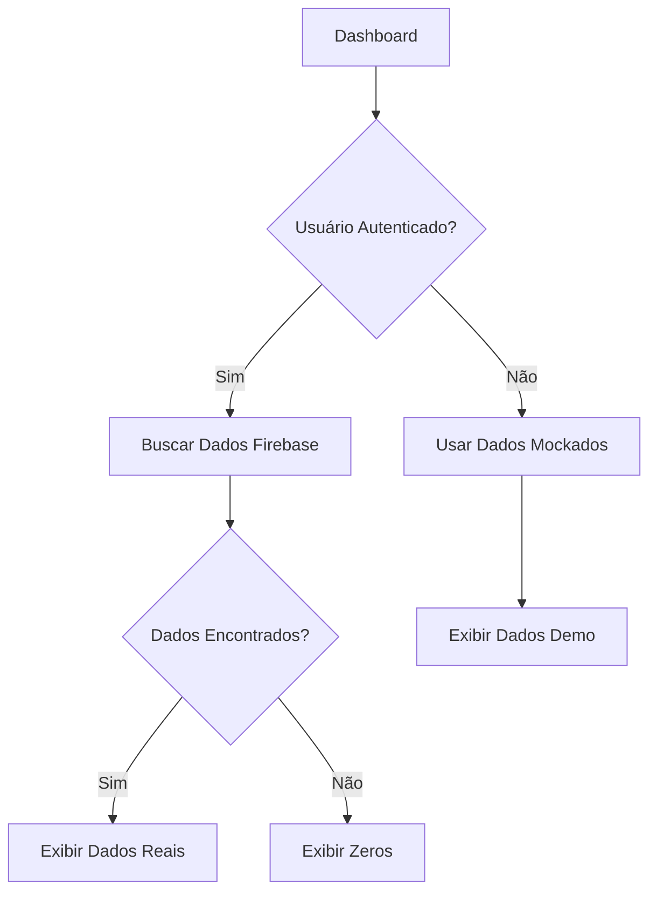

# 🔥 Correção de Permissões do Firebase

## ❌ Problema Atual
O dashboard está apresentando erro "Missing or insufficient permissions" porque:
1. As regras do Firestore exigem autenticação
2. O usuário não está autenticado adequadamente
3. Não há dados de teste na coleção `visits`

## ✅ Soluções Disponíveis

### Opção 1: Aplicar Regras Temporárias (RECOMENDADO)
Para desenvolvimento, aplique regras permissivas:

```bash
# Aplicar regras de desenvolvimento
./scripts/apply-dev-rules.sh

# Quando terminar, restaurar regras de produção
./scripts/restore-prod-rules.sh
```

### Opção 2: Login no Sistema
1. Acesse `/login`
2. Faça login com um usuário válido
3. O dashboard usará os dados da organização do usuário

### Opção 3: Configurar Firebase Emulator (Local)
```bash
# Instalar emulator
npm install -g firebase-tools
firebase init emulators

# Rodar localmente
firebase emulators:start
```

## 🔧 Status Atual

### ✅ Implementado
- [x] Serviço Firebase Dashboard
- [x] Integração com dados reais de visitas
- [x] Cálculo de larvas positivas
- [x] Classificação por bairro
- [x] Fallback para dados mockados
- [x] Verificação de autenticação

### 🔄 Em Desenvolvimento
- [ ] Dados de seed para teste
- [ ] Autenticação automática para desenvolvimento
- [ ] Emulator local configurado

## 🚀 Próximos Passos

1. **Aplicar regras temporárias**: `./scripts/apply-dev-rules.sh`
2. **Testar integração**: Verificar se dados são carregados
3. **Criar dados de teste**: Adicionar visitas de exemplo
4. **Restaurar segurança**: `./scripts/restore-prod-rules.sh`

## 📊 Como Funciona



## ⚠️ Avisos Importantes

- **Regras de desenvolvimento são INSEGURAS**
- **Nunca usar em produção**
- **Sempre restaurar regras originais**
- **Dados reais serão zeros até haver visitas registradas**
